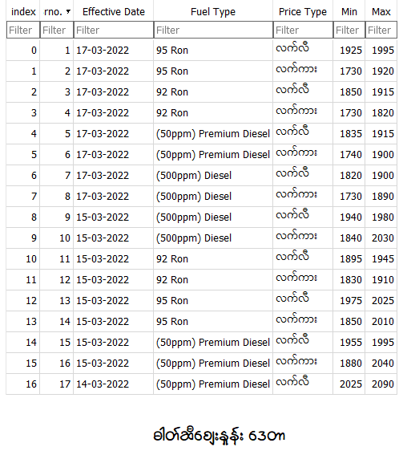

## 2022 Code 

### Project 1 - Scraping Tableau Featured Developer page 
- Main idea is to make monthly scraper to collect Tableau Dev data and make an analysis/viz.
- Tools -> `Selenium` , `BeautifulSoup` , `Datasette` , `Python` 
-----
### Project 2 - Scraping Petrol Price from Myanmar Petroleum Trade Association 
- Tools -> `selenium` , `pandas`

- Remaining to do :pencil:
    - [ ] Update to Datasette
    - [ ] Automate with Github Action

### Project 3 - Scrape from Wisarra
- Tools -> `requests-html` , `pandas` , `sqlite`

- Process alomost done!
- Remaining to do :pencil:
    - [ ] Update to Datasette